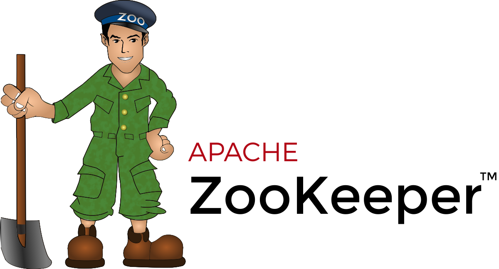
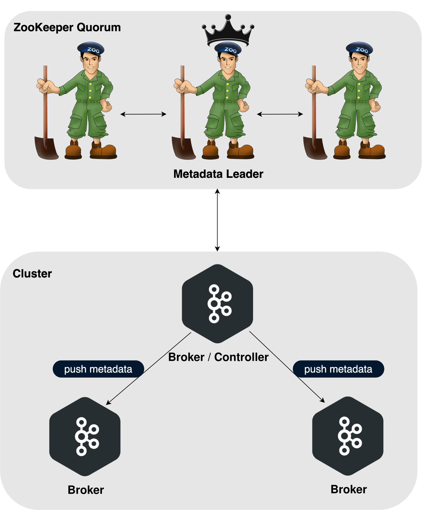
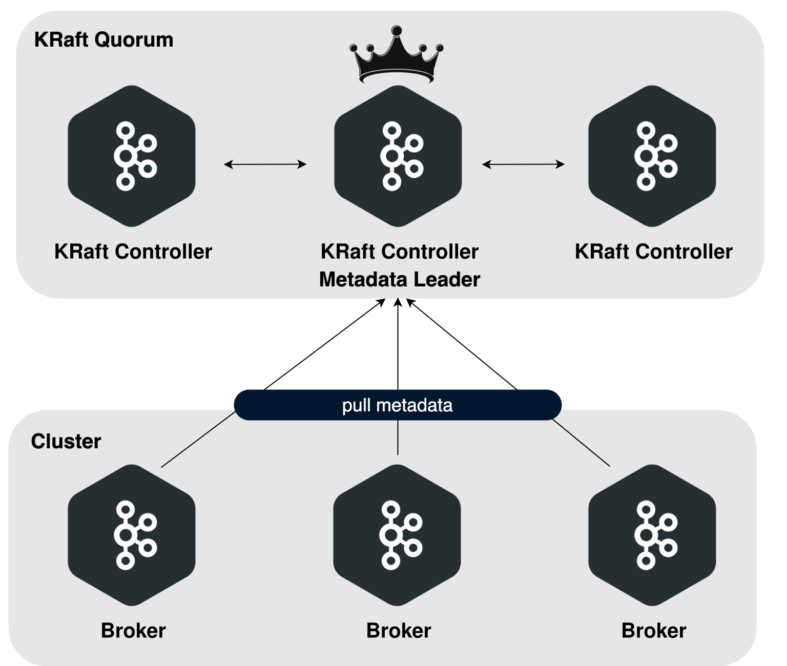

[%notitle]
== Migrer vers 4.x

[.step.without-bullets]
* 📘 link:https://kafka.apache.org/documentation/#upgrade_4_0_1_from[Migrer vers 4.x]
* 🧹 Grand ménage
* 💸 Coûts et complexité à maintenir

[.notes]
--
* avant de profiter des fonctionnalités, il faut migrer
* documentation mise à jour (il y a eu une KIP là dessus)
* 1ère chose à retenir : il y a eu du ménage
* stoper le support des anciennes versions permet d'*encourager les utilisateurs à migrer plus souvent*
--

[%notitle]
=== Java et Scala

[.step.without-bullets]
* ❌ Java 8 et Scala 2.12 plus supportés
* ☕️ Kafka Clients & Kafka Streams → Java 11
* ☕️ Broker, Connect, Tools, MM2 → Java 17

[.notes]
--
* Réduire le coût de maintenance multi-JDK
* KIP-720 : MirrorMaker 1 supprimé
* 4.2.0 : support java 25
* KIP-750 : java
* KIP-751 : scala
* KIP-1032 : jakarta / javaEE
--

=== Protocole client-broker

[.step.without-bullets]
* ❌ Retrait des anciennes API client-broker
* ⚙️ Broker 4.0 ⇄ Clients ≥ 2.1, Clients 4.0 ⇄ Brokers ≥ 2.1
* 👨‍💻 Ops : activer la métrique `DeprecatedRequestsPerSec` sur les brokers (3.7+), si >0 alors impact

[.notes]
--
* Il s'agit du **client-broker protocol** (RPC)
* 2.1 sorti en 2018
* KIP-896
--

=== Format de message

[.step.without-bullets]
* ❌ Formats de message v0/v1 plus supportés en écriture
* ✉️ Le “nouveau” format v2 devient l'unique format côté écriture

[.notes]
--
* "nouveau" format v2 introduit avec Kafka 0.11.0.0 (juin 2017)
* Objectifs: cohérence, performances (moins de conversions), et bénéficier nativement d'idempotence, transactions, headers, leader epoch, etc. (tous liés à v2).
* KIP-724
--

=== Migration vers Log4j2

[.step.without-bullets]
* ❌ Sortir définitivement de Log4j 1.x
* ⚙️ Outil de migration `log4j-transform-cli`
* 💻 `config-file convert -i log4j1 -o log4j2 <inputFile> <outputFile>`

[.notes]
--
* Log4j 1.x (obsolète depuis 2012)
* pas obligé de migrer mais l'équipe log4j2 annonce une *compatibilité limitée*
* hors scope : l'appender log4j1 fournit pour ne pas casser les configs existantes
* KIP-653
--

=== Config par défaut modifiée

[.step]
* linger.ms: 0 ms → 5 ms
* message.timestamp.after.max.ms: ∞ → 1 h
* segment.bytes (min): 14 B → 1 MB
* num.recovery.threads.per.data.dir: 1 → 2
* ...

[%notitle%auto-animate]
=== Zookeeper

[%notitle%auto-animate.columns.is-vcentered]
=== Zookeeper

[.column.is-one-third]
--

--

[.column.has-text-right]
****
[.step.without-bullets]
* 🗳️ Consensus distribué, élection de leader
* 🤝 Coordination du cluster (Broker en vie ? Qui est controller ? Pannes, découvertes ...)
* 💾 Stockage des métadonnées (topics, partitions, ACL, ...)
****

[.notes]
--
* broker alive, qui est le controller
--

=== Avec ZooKeeper

[.notes]
--
* limitations 200 000 partitions par cluster
* ralentissement sur la lecture des métadata
* ajout de complexité pour les ops : deux systèmes à maintenir
--

=== KRaft

[.notes]
--
* production ready depuis la 3.5
* vient de Raft : algorithme de consensus
--

=== Avec KRaft

[.notes]
--
* stockage des *metadata sur un topic interne*
* *réduit la latence* des opérations de gestion du cluster
* améliore la *scalabilité* et la *résilience*
* simplifie le déploiement et l'exploitation : 1 seul processus
* un broker est soit un broker normal, soit un controller, soit les 2 (mode combiné)
* en prod déployer 3 controllers au moins pour de la HA
--

=== Migration

[.step.without-bullets]
* 🏥 Avoir un cluster sain (pas de partition offline, réplication stable ...)
* ⬆️ Monter en 3.9.x
* 🧪 Migration en environnement de tests
* (et tester la procédure de rollback!)
* 📈 Monitorer les logs et JMX

[.notes]
--
* mode bridge dispo depuis la 3.5
* rolling update sans downtime
--
