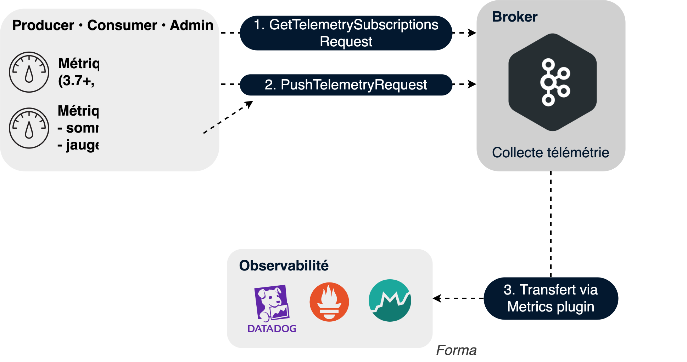
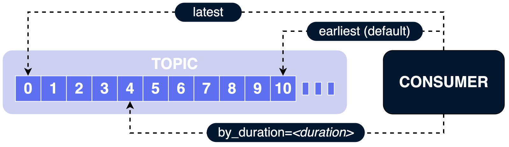
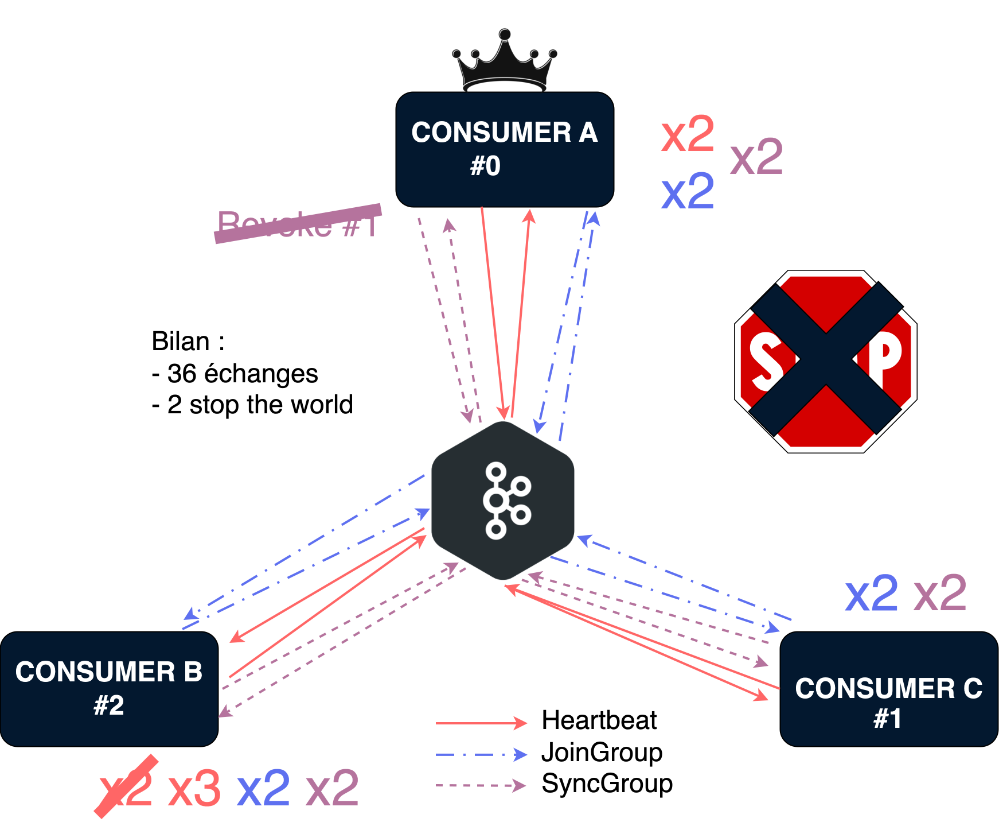
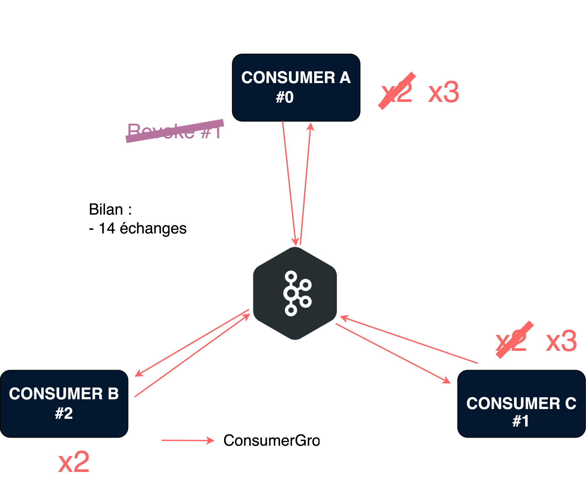
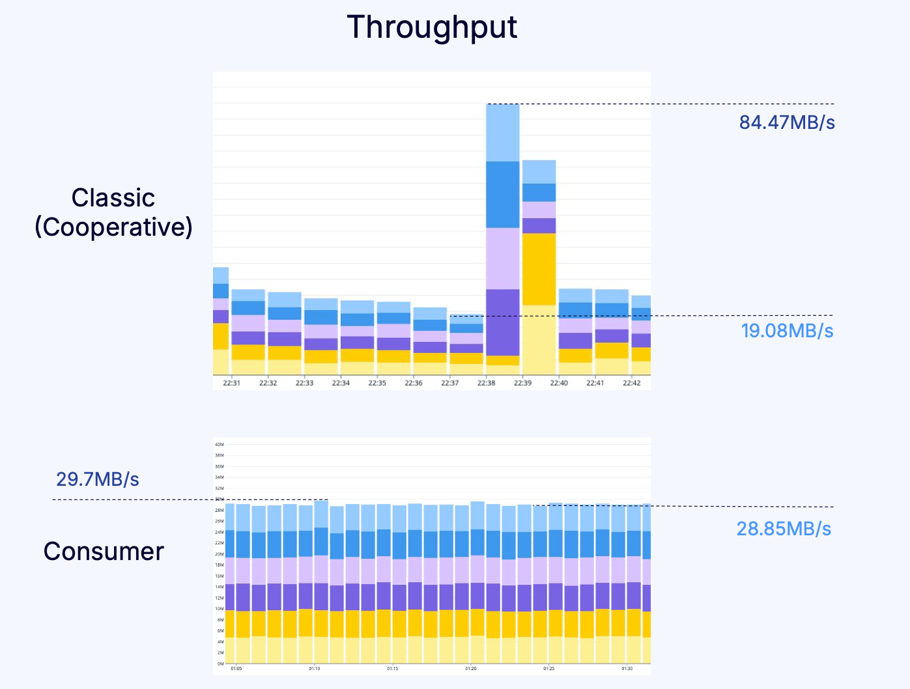

== 4.0.0

=== Métriques clients via broker

[.notes]
--
* problème : pas d'interface standard, manque de visibilité sur les métriques applicatives
* *registerMetricForSubscription*(KafkaMetric metric) / *unregisterMetricFromSubscription*(KafkaMetric metric)
* Résultat: *observabilité “complète”*
* Types de métriques limités (sum/gauge) Sum : Compteur monotone (par exemple, nombre total de messages traités). Gauge : Valeur non monotone (par exemple, taux de traitement).
--

[%notitle]
=== Implémentation métrique

[.large-code-exemple]
--

[source,java,highlight=1..2|4..5|6..11|16..17]
----
Metrics local = new Metrics(new MetricConfig());
Sensor messageSensor = local.sensor("message-count-sensor");

LinkedHashMap<String, String> tags = new LinkedHashMap<>();
tags.put("component", "my-app");
MetricName metricName = new MetricName(
    "total-messages-processed",
    "application",
    "Total messages processed",
    tags
);

messageSensor.add(metricName, new CumulativeCount());
KafkaMetric metric = local.metrics().get(metricName);

consumer.registerMetricForSubscription(metric);
consumer.unregisterMetricFromSubscription(metric);
----

--

=== auto.offset.reset

[.notes]
--
* Offset reset depuis une durée
* Tirer parti du stockage longue durée (tiered storage)pour reprendre “à X temps en arrière”
* usages : data analytics, reprise sur incident
* KIP-1106
--

=== Format ISO-8601

* PnDTnHnMn.nS
* Exemples:
** P30D → 30 jours
** PT12H → 12 heures
** P1DT30M → 1 jour et 30 minutes

=== Rebalance

[%notitle]
=== Avant

[.notes]
--
* problème : 
** "stop the world" = "synchronisation barrier"
** difficile de trouver la *root cause* car beaucoup d'échanges
** s'il y a un *consumer qui a du lag* ? tout le groupe attend
--

[%notitle]
=== Après

[%notitle.blue.background]
=== Perf consommation 

[.notes]
--
* provenance de l'étude : https://current.confluent.io/2024-sessions/the-performance-of-kafkas-new-consumer-rebalance-protocol
* production constante à 29 MB/s
* 1 consommateur *avec lag important* impacte tout le groupe
--
=== Consumer Group Protocol

[.step.without-bullets]
* 🔁 Rebalance incrémental
* 🎯 Géré par le coordinator, facilite le débug
* ⚙️ Activé par défaut côté serveur, côté client : `group.protocol=consumer`
* ⚖️ Compromis : usage CPU côté serveur, empreinte mémoire plus élevée
* 💻 Outils d'admin : kafka-groups.sh, kafka-consumer-groups.sh

[.notes]
--
* ce n'est pas activé par défaut car il faut que le consumer et broker soient tous les 2 en 4.0
* profite également à Kafka Connect car protocol conçu de manière générique : il assigne des ressources à des groupes
* KIP-848 - 4.0.0
--

=== Streams rebalance protocol

[.step.without-bullets]
* ✔ *GA en 4.2.0*
* 🧩 Se base sur le Consumer Group Protocol
* 🔀 Même principe mais pour l'assignation des tâches Kafka Streams

[.notes]
--
* GA en 4.2.0 avec un feature set limité : ne gère pas les assignors custom
* KIP-1071
--
