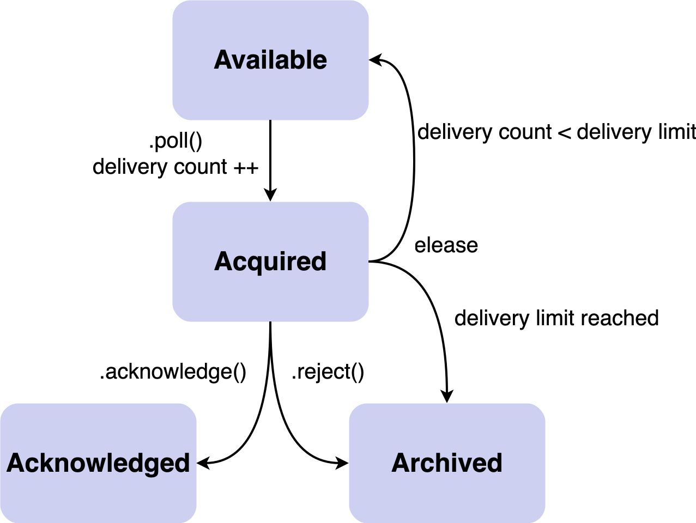

== 4.1.0

=== Métriques des plugins Kafka

[.notes]
--
* KIP-877
--

=== Qu'est-ce qu'un plugin Kafka ?

[.step]
* *Broker*: Authorizer, CreateTopicPolicy, ClientQuotaCallback, ReplicaSelector
* *Producer*: Serializer, Partitioner, ProducerInterceptor
* *Consumer*: Deserializer, ConsumerInterceptor
* *Connect*: Converter, Transform, Predicate, Connector, Task

[.notes]
--
* problème : *pas de standard*, duplication de metriques, difficulté à associer métriques plugin/client
--

=== Implémentation

[.large-code-exemple]
--

[source,java,highlight=1..2|6..13|15..19]
----
public class MyInterceptor<K, V> 
  implements ProducerInterceptor<K, V>, Monitorable {
  
  private Sensor sensor;

  @Override
  public void withPluginMetrics(PluginMetrics metrics) {
    sensor = metrics.sensor("onSend");
    MetricName rate  = metrics.metricName("rate",  "Average number of calls per second.", new LinkedHashMap<>());
    MetricName total = metrics.metricName("total", "Total number of calls.",             new LinkedHashMap<>());
    sensor.add(rate,  new Rate());
    sensor.add(total, new CumulativeCount());
  }

  @Override
  public ProducerRecord<K,V> onSend(ProducerRecord<K,V> record) {
    sensor.record();
    return record;
  }
}
----

--

[.notes]
--
* deux nouvelles interfaces : Monitorable et PluginMetrics
* facilité : métriques attachées au Metrics du composant hôte, taguées automatiquement pour identifier le plugin.
* plus besoin de gérer les reporters : c'est fait automatiquement.
--

=== Migration métriques consumer

[.step]
* *Problème*:
** Producer: `topic.a.b` ✅
** Consumer: `topic.a.b` → `topic_a_b` ❌

[.step]
* *Solution*:
** 4.x: Ajoute `topic.a.b` (nouveau) + conservation `topic_a_b` (déprécié)
** 5.0: Seulement `topic.a.b` 🎉

[.notes]
--
* qui met des points dans les noms de ses topics ?
* problème : les points sont *remplacés par des underscores*
* pourquoi ? *code legacy* pour s'*aligner avec le modèle de graphite*
* Identifiez vos dashboards avec `topic_a_b` et Migrez vers `topic.a.b` avant 5.0
* KIP-1109
--

=== OAuth2 grant type

[.step.without-bullets]
* ❗️ *Problème*: seul client_credentials supporté
** Secret statique = Potentiel risque de sécurité
[.step.without-bullets]
* 🔐 *Solution*: jwt-bearer (RFC 7523)
** Authentification via JWT signé

[.notes]
--
* Beaucoup d'IdP (cloud) n'*autorisent pas* client_credentials (secret statique)
* Sécurité + flexibilité (RBAC, multi-tenant)
* KIP-1139
--

=== Kafka Connect: support plugins multi-versions

[.step]
* *Problème*: 1 version par cluster
* Difficulté à gérer les montées de versions, rollback etc ...
* 🎛️ *Nouveauté*: Support de plusieurs versions de plugins sur un cluster 

[.notes]
--
* plugin type connecteur postgresql, debezium, etc.
* Upgrades en 2 temps avec rollback facile
* Réduction clusters Connect
* KIP-891 - 4.1.0
--

=== Installation

[source,bash,highlight=1..10|6..8]
----
opt/
  plugins/
    foo-connector-1.8/
      foo-connector-1.8.jar
      foo-dependencies-1.0.jar
    foo-connector-1.9/
      foo-connector-1.9.jar
      foo-dependencies-1.1.jar
    bar-connector/
      bar-connector-1.0.jar
----

=== Utilisation

[.step]
* Spécifier la version souhaitée
** `"xxx.plugin.version": "[3.5,)"`
* Versions visibles de manière distincte dans l'API

[.notes]
--
* notation maven range
* API mise à jour
--

=== Queues for Kafka

[.step.without-bullets]
* Nouvelle manière de consommer un topic

=== Rappel consommateur classique

image:images/consumerClassic.svg[]

=== Rappel Point à point / Queue

[.step.without-bullets]
* 👤 Message consommé par un seul consommateur
* 🔄 Traitement asynchrone
* ✅ Acquittement au message
* 🗑️ Suppression du message après traitement

[.notes]
--
* en *fonction de la configuration* du broker
* Non ce n'est pas ce qui a été implémenté
--

=== Share Groups

[.step.without-bullets]
* 🔧 API identique au consumer group
* ➗ Permet la consommation de messages d'*une seule partition* par plusieurs consommateurs
* ✅ Acquittement au message

[%notitle]
=== Schéma

image:images/shareConsumer.svg[]

[.notes]
--
* *plus de limite* de consommateurs par topic
* les deux types de consommateurs peuvent *cohabiter*
--

=== Acquittement

[.step]
* `share.acknowledgement.mode=implicit` (default) : acquittement automatique lors du poll()
* `share.acknowledgement.mode=explicit`

=== Explicite

[source,java,highlight=1..5|6..7|9..13|15..16|18..20|21..23]
----
@️KafkaListener(
    topics = "order-processing",
    groupId = "order-processors",
    containerFactory = "shareKafkaListenerContainerFactory"
)
public void processOrder(OrderEvent event,
                         ShareAcknowledgment acknowledgment) {
  try {
    if (!isValid(event)) {
      log.info("Rejet du message, ne sera pas re-deliveré");
      acknowledgment.reject();
      return;
    }

    orderService.process(event);
    acknowledgment.acknowledge();

  } catch (TransientException e) {
    log.info("Erreur temporaire, rejeu possible");
    acknowledgment.release();
  } catch (PermanentException e) {
    log.info("Rejet du message, ne sera pas re-deliveré");
    acknowledgment.reject();
  }
}
----

[%notitle]
=== RecordState

=== Nouvelles propriétés

[.step]
* `share.delivery.count.limit: 5`
* `share.record.lock.duration.ms: 30000` (30 sec)

=== Cas d'usage

[.step.without-bullets]
* ✉️ Nécessité d'acquittement au message avec rejeu/rejet
* 📈 Mise à l'échelle sans garantie d'ordre
* 🔁 Faciliter la migration de système type queue vers Kafka

=== Preview

[.step.without-bullets]
* 🚀 Production ready pour la 4.2.0
* 💻 Outil d'admin : kafka-share-groups.sh
* 📨 Intégration de Dead Letter Queue
* ❓ Garantie d'ordre en réflexion

[.notes]
--
* KIP-932 
--

