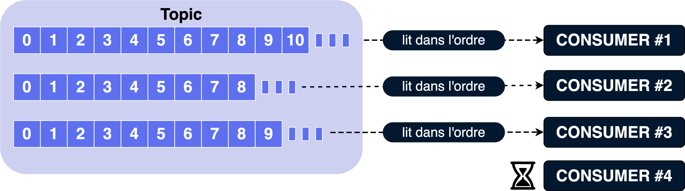
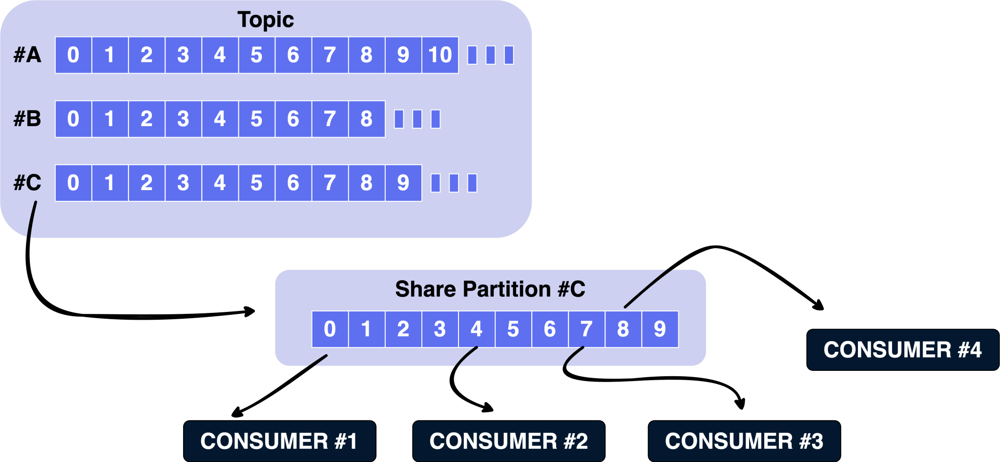
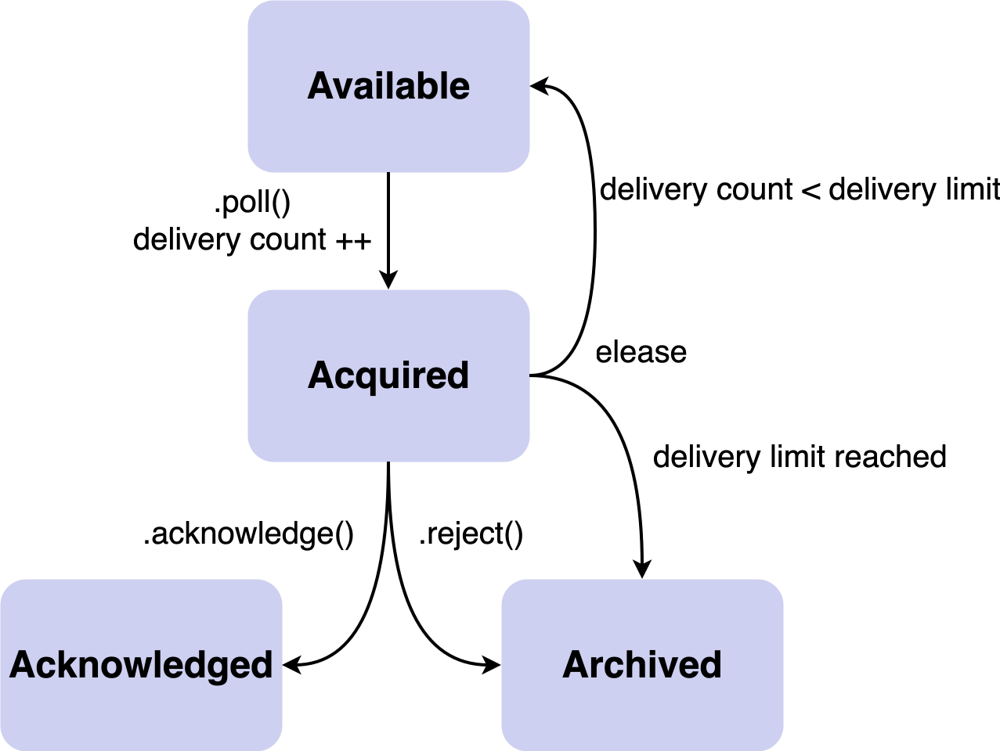

== 4.2.0

=== Dead Letter Queue dans Kafka Streams

[.step.without-bullets]
* 🛞 kstreamplify de Michelin
* ❌ *Avant*: `CONTINUE` (perte) ou `FAIL` (crash) : DLQ custom à gérer
* ✅ *Apres*: nouveau retour `Response.sendToDeadLetterQueue()`

[.notes]
--
* initiative de dév de chez Michelin avec kstreamplify
* KIP-1034 - 4.2.0
* Support dans les 3 handlers : Deserialization / Processing / Production
--

=== Queues for Kafka

[.step.without-bullets]
* Nouvelle manière de consommer un topic

=== Rappel consommateur classique

=== Rappel Point à point / Queue

[.step.without-bullets]
* 👤 Message consommé par un seul consommateur
* 🔄 Traitement asynchrone
* ✅ Acquittement au message
* 🗑️ Suppression du message après traitement

[.notes]
--
* en *fonction de la configuration* du broker
* Non ce n'est pas ce qui a été implémenté
--

=== Share Groups

[.step.without-bullets]
* 🔧 API identique au consumer group
* ➗ Permet la consommation de messages d'*une seule partition* par plusieurs consommateurs
* ✅ Acquittement au message

[%notitle]
=== Schéma

[.notes]
--
* *plus de limite* de consommateurs par topic
* les deux types de consommateurs peuvent *cohabiter*
--

=== Acquittement

[.step]
* `share.acknowledgement.mode=implicit` (default) : acquittement automatique lors du poll()
* `share.acknowledgement.mode=explicit`

=== Explicite

[source,java,highlight=1..5|6..7|9..13|15..16|18..20|21..23]
----
@️KafkaListener(
    topics = "order-processing",
    groupId = "order-processors",
    containerFactory = "shareKafkaListenerContainerFactory"
)
public void processOrder(OrderEvent event,
                         ShareAcknowledgment acknowledgment) {
  try {
    if (!isValid(event)) {
      log.info("Rejet du message, ne sera pas re-deliveré");
      acknowledgment.reject();
      return;
    }

    orderService.process(event);
    acknowledgment.acknowledge();

  } catch (TransientException e) {
    log.info("Erreur temporaire, rejeu possible");
    acknowledgment.release();
  } catch (PermanentException e) {
    log.info("Rejet du message, ne sera pas re-deliveré");
    acknowledgment.reject();
  }
}
----

[%notitle]
=== RecordState

=== Nouvelles propriétés

[.step]
* `share.delivery.count.limit: 5`
* `share.record.lock.duration.ms: 30000` (30 sec)

=== Cas d'usage

[.step.without-bullets]
* ✉️ Nécessité d'acquittement au message avec rejeu/rejet
* 📈 Mise à l'échelle sans garantie d'ordre
* 🔁 Faciliter la migration de système type queue vers Kafka

=== Depuis la 4.2.0

[.step.without-bullets]
* 🚀 *Production ready*
* 🔄 Nouveau type d'acquittement : `RENEW` (prolonger le temps de traitement)
* 📊 Métriques de lag pour les Share Groups
* 💻 Outil d'admin : kafka-share-groups.sh

[.notes]
--
* KIP-932 : marqué stable en 4.2.0
* KIP-1222 : RENEW permet d'étendre le lock d'un message si le traitement prend plus longtemps que share.record.lock.duration.ms
* KIP-1226 : métriques de lag pour monitorer la progression de la consommation
* KIP-1206 : mode record_limit pour un contrôle plus fin du fetch
--

